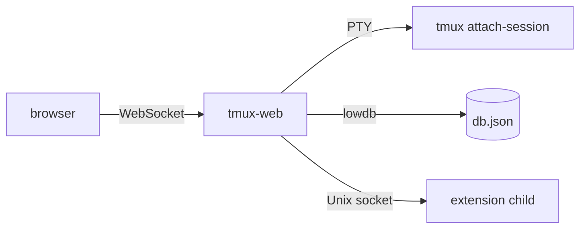

# Architecture

## Overview

## Components

- **Landing page** — Lists all active tmux sessions; clicking one opens a full terminal view powered by a local xterm.js client bundle by default.
- **Terminal** — The browser connects over WebSocket; the server spawns `tmux attach-session` via a PTY. Resize, input, and scrollback work; the client auto-reconnects if the connection drops. The terminal renderer defaults to `xterm`; start with `tmux-web --ghostty` or `TMUX_WEB_TERMINAL_RENDERER=ghostty tmux-web` to use ghostty-web instead. `--xterm` forces the default renderer.

### Terminal buffer loading

On attach, tmux replays the full pane history into the PTY. tmux-web avoids rendering that replay in the browser:

1. **Sync window** — PTY output is dropped for a short idle period (or until a max timeout) while tmux finishes its attach refresh.
2. **Tail snapshot** — The server captures the last *N* lines with `tmux capture-pane` and sends a JSON `snapshot` message. The client resets the emulator and paints that tail at the bottom.
3. **Live stream** — Further PTY output is sent as JSON `data` messages.
4. **Scroll-up** — When the user reaches the top of loaded scrollback, the client sends `load_history`; the server returns older lines via `capture-pane`, and the client prepends them with a reset+rewrite.

If the pane is on the **alternate screen** (vim, less, etc.), no snapshot is sent; live PTY output is forwarded immediately after sync so full-screen apps are not corrupted.

| Environment variable | Default | Purpose |
|---------------------|---------|---------|
| `TMUX_WEB_INITIAL_LINES` | `1000` | Lines in the initial tail snapshot |
| `TMUX_WEB_HISTORY_CHUNK` | `500` | Lines fetched per scroll-up request |
| `TMUX_WEB_SYNC_IDLE_MS` | `200` | Idle time after last PTY byte before sync ends |
| `TMUX_WEB_SYNC_MAX_MS` | `3000` | Maximum sync duration before live forwarding |
| `TMUX_WEB_TERMINAL_RENDERER` | `xterm` | Browser renderer: `xterm` or `ghostty` |

WebSocket messages are JSON: server → client `snapshot`, `data`, `history`; client → server `input`, `resize`, `load_history`. The browser renderer is isolated in the terminal client bundle so the page shell, WebSocket protocol, and tmux capture flow can survive a future renderer swap.

### Image paste (Claude Code, OpenCode, etc.)

CLI tools that accept pasted images expect a **file on the host**, not inline terminal graphics. tmux-web bridges the browser clipboard or drag-and-drop:

1. **Upload** — `POST /api/session/:session/upload` saves the image under `{dataRoot}/uploads/YYYY-MM-DD/{uuid}.{ext}` (PNG, JPEG, WebP, or GIF; UUID filename only).
2. **Inject path** — The absolute path is sent into the pane via WebSocket `input`, as if typed, so the app can attach it (e.g. `[Image #1]` in Claude Code).

Paste (Cmd/Ctrl+V) prefers clipboard images over plain text when both are present. Drag an image onto the terminal canvas to upload the same way.

| Environment variable | Default | Purpose |
|---------------------|---------|---------|
| `TMUX_WEB_MAX_IMAGE_UPLOAD_BYTES` | `10485760` (10 MiB) | Maximum upload size per image |

If tmux-web is exposed beyond localhost, treat uploads as sensitive (paths are readable by processes on the host). No automatic cleanup of `uploads/` in v1.

- **Themes** — Built-in templates (`vscode`, `ghostty`) define shell CSS variables and xterm palette. The active theme is persisted at `{configRoot}/tmux-web/theme.json` (e.g. `~/.config/tmux-web/theme.json`) and loaded once at server startup. Switch with `tmux-web theme set <name>` and restart the server. If the file is missing, `vscode` is written automatically (matches the previous default look).

- **Notes** — Per-session and global Markdown scratchpads persist to `~/.tmux-web/db.json` via lowdb (or `~/.dev/.tmux-web/db.json` in dev mode). See [Notes](notes.md).
- **Scheduler** — Queues `tmux send-keys` calls to fire after a delay and re-arms surviving tasks on restart. See [Scheduler](scheduler.md).
- **Windows drawer** — On the terminal page, a header tab icon opens a drawer listing tmux windows in the current session. Tapping a row runs `tmux select-window` on the host so the attached PTY switches without mobile keybindings. List: `GET /api/session/:session/windows`; switch: `POST /api/session/:session/select-window` with body `{ windowIndex: number }`.
- **Extensions** — Sidebar plugins run as isolated child processes; the host reverse-proxies `/ext/<id>/api/*` to each extension over a Unix socket. See [Extensions](extensions.md) for install, config, and author guide.
