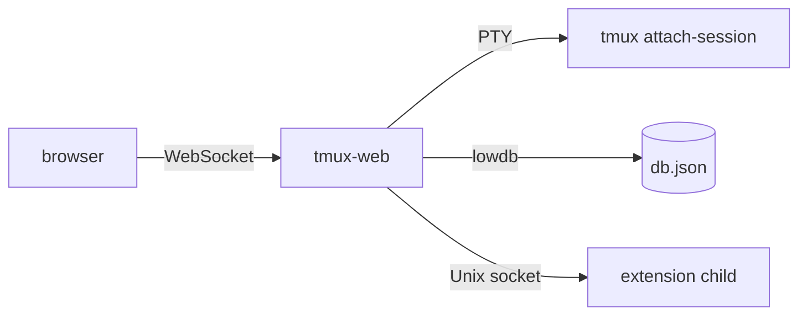

# Architecture

## Overview

## Components

- **Landing page** — Lists all active tmux sessions; clicking one opens a full terminal view powered by [ghostty-web](https://github.com/nickolay/ghostty-web).
- **Terminal** — The browser connects over WebSocket; the server spawns `tmux attach-session` via a PTY. Resize, input, and scrollback work; the client auto-reconnects if the connection drops.

### Terminal buffer loading

On attach, tmux replays the full pane history into the PTY. tmux-web avoids rendering that replay in the browser:

1. **Sync window** — PTY output is dropped for a short idle period (or until a max timeout) while tmux finishes its attach refresh.
2. **Tail snapshot** — The server captures the last *N* lines with `tmux capture-pane` and sends a JSON `snapshot` message. The client resets the emulator and paints that tail at the bottom.
3. **Live stream** — Further PTY output is sent as JSON `data` messages.
4. **Scroll-up** — When the user reaches the top of loaded scrollback, the client sends `load_history`; the server returns older lines via `capture-pane`, and the client prepends them with a reset+rewrite.

If the pane is on the **alternate screen** (vim, less, etc.), no snapshot is sent; live PTY output is forwarded immediately after sync so full-screen apps are not corrupted.

| Environment variable | Default | Purpose |
|---------------------|---------|---------|
| `TMUX_WEB_INITIAL_LINES` | `1000` | Lines in the initial tail snapshot |
| `TMUX_WEB_HISTORY_CHUNK` | `500` | Lines fetched per scroll-up request |
| `TMUX_WEB_SYNC_IDLE_MS` | `200` | Idle time after last PTY byte before sync ends |
| `TMUX_WEB_SYNC_MAX_MS` | `3000` | Maximum sync duration before live forwarding |

WebSocket messages are JSON: server → client `snapshot`, `data`, `history`; client → server `input`, `resize`, `load_history`.
- **Notes** — Per-session and global Markdown scratchpads persist to `~/.tmux-web/db.json` via lowdb (or `~/.dev/.tmux-web/db.json` in dev mode). See [Notes](notes.md).
- **Scheduler** — Queues `tmux send-keys` calls to fire after a delay and re-arms surviving tasks on restart. See [Scheduler](scheduler.md).
- **Extensions** — Sidebar plugins run as isolated child processes; the host reverse-proxies `/ext/<id>/api/*` to each extension over a Unix socket. See [Extensions](extensions.md) for install, config, and author guide.
